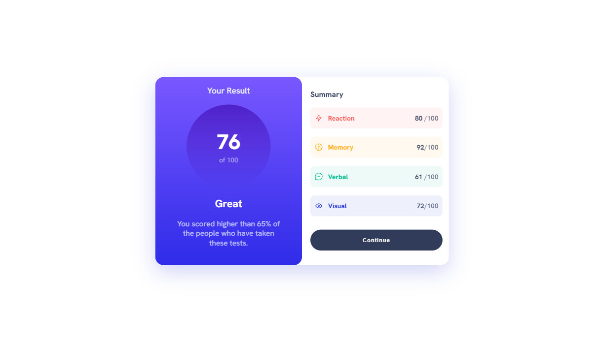
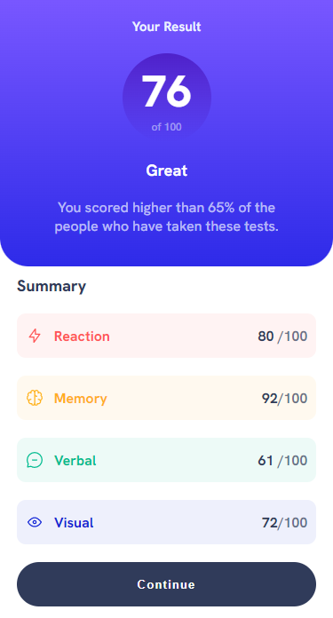

# Summary Card Component with Peek-and-Slide Animation - ReactJS

This is my solution for the Summary Card Component challenge from Frontend Mentor with an added peek-and-slide animation effect. The challenge was to create a responsive summary card component that displays a result summary of a particular skill or category.
## Table of Contents

- [Overview](#overview)
    - [Screenshot](#screenshot)
    - [Links](#links)
- [Features](#features)
- [Technologies](#technologies)
- [Setup](#setup)
- [Usage](#usage)
- [Acknowledgements](#acknowledgements)
- [Credits](#credits)

## Overview

This is a README file for a project that includes a Summary Card Component developed with React and an added peek-and-slide animation effect. The summary card component is responsive and displays  a result summary of a particular skill or category. The card  has a a peek-and-slide animation effect on  load.

### Screenshot

|  |  |
| ------------------------------ | ----------------------------- |
| Desktop version                | Mobile version                |

### Links

- [Live Demo](https://hatemhenchir.github.io/results-summary-component/)
- [Repository](https://github.com/hatemhenchir/results-summary-component/)

## Features

The features of this project are as follows:

- Displays the number of challenges completed, rank, and points
- Animation effect on load
- Responsive design for desktop and mobile

## Technologies

The technologies used in this project are as follows:

- React
- HTML
- CSS
- JavaScript

## Setup

To set up this project, follow the steps below:

1. Clone the repository: `git clone https://github.com/hatemhenchir/results-summary-component.git`
2. Install dependencies: `npm install`
3. Start the development server: `npm start`
4. Open the application in your browser at `http://localhost:3000`

## Usage

To use this project, follow the steps below:

1. Open the application in your browser at `http://localhost:3000`
2. Click on the share button to display the social media icons with a fade-in animation effect
3. Click on any social media icon to share the article
4. Scroll down the page to view the fade-in animation effect on the article preview components

## Acknowledgements

This project was developed with reference to the following resources:

- [Frontend Mentor](https://www.frontendmentor.io/challenges/challenge-result-summary-card-Xyz2Vfljl) for providing the challenge
- [React documentation](https://reactjs.org/docs/getting-started.html) for reference and guidance

## Credits

- My LinkedIn: [@hatem-henchir-7a92141a8](https://www.linkedin.com/in/hatem-henchir-7a92141a8/)
- My Frontend Mentor: [@hatemhenchir](https://www.frontendmentor.io/profile/hatemhenchir)